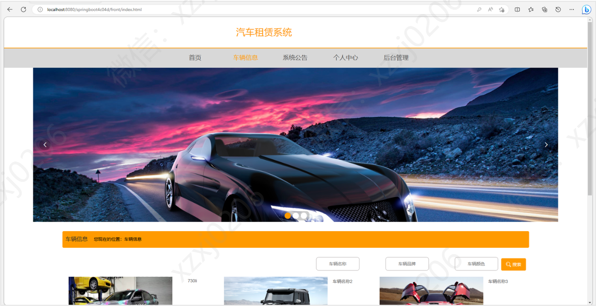
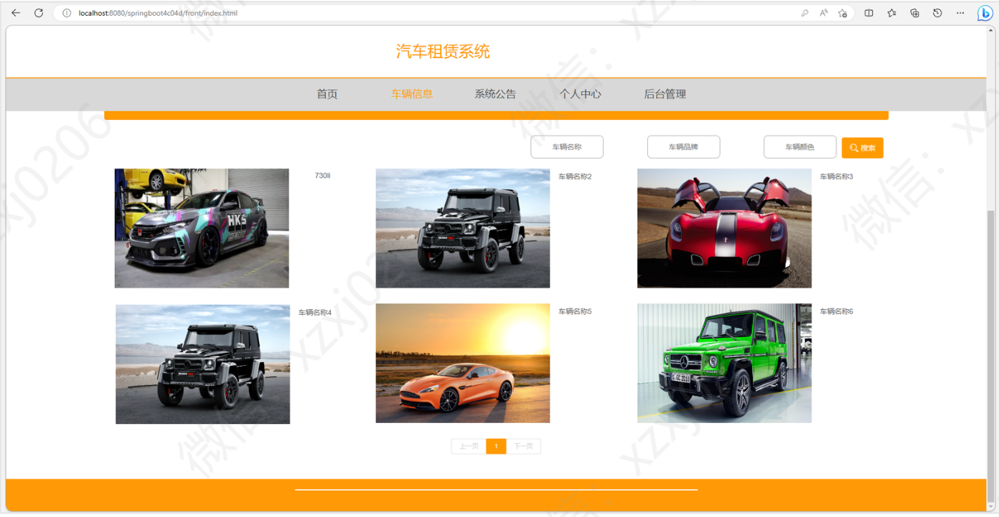
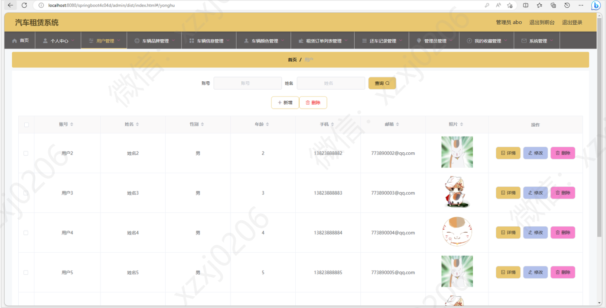
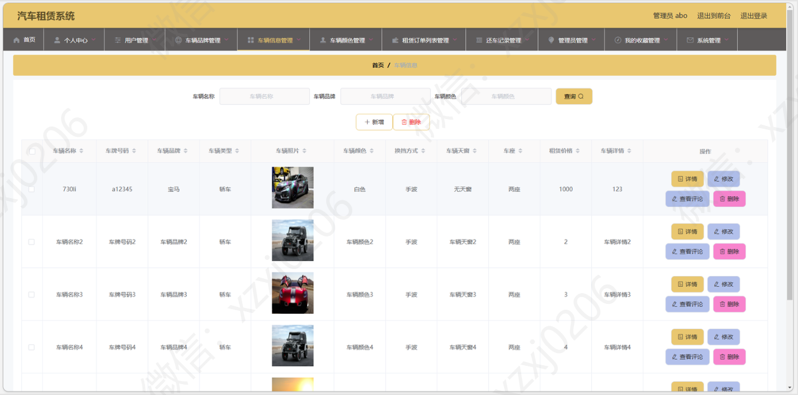
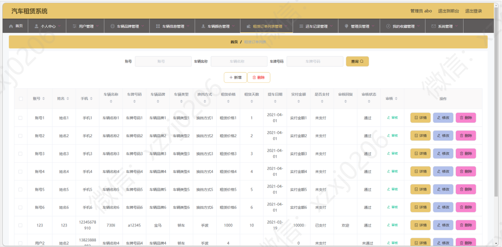
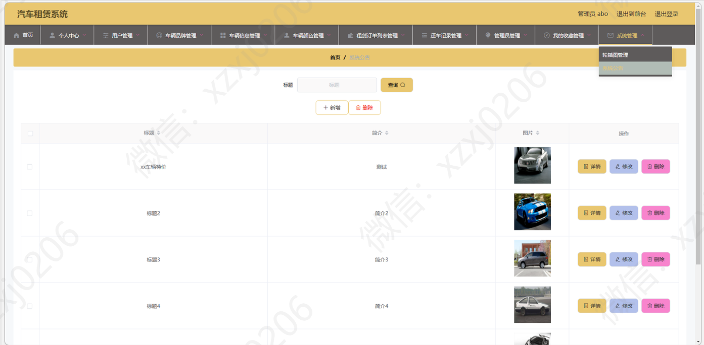
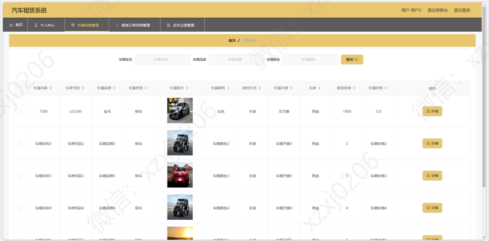
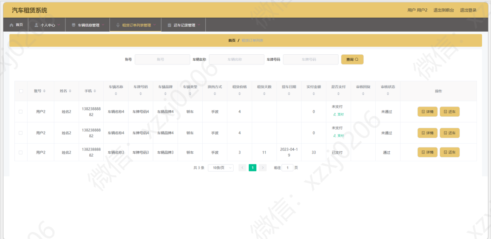
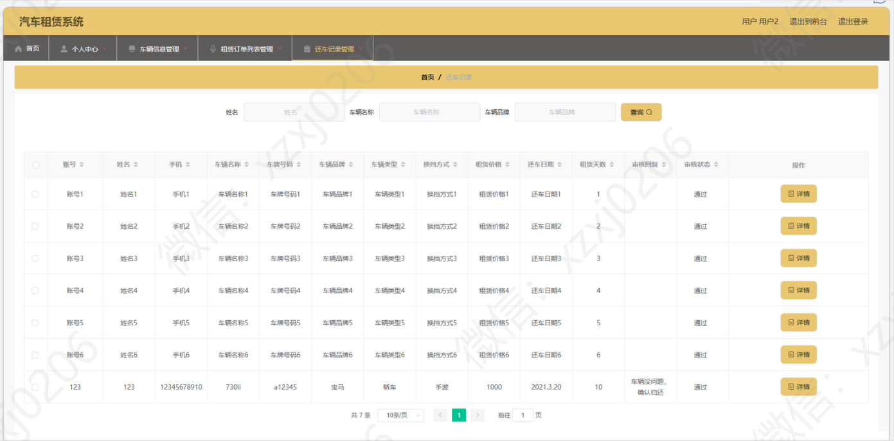

# 汽车租赁系统
### 9.9￥ 获取完整源码+sql，需要加Q：3577148218 ,备用Q: 3808981644
### 有问题，或者需要协助调试运行项目的也可联系

### 更多项目： https://github.com/34426?tab=repositories

## 一、 介绍

基于springboot+layui的汽车租赁系统

语言：java

运行工具：idea或eclipse 数据库：mysql

## 二、 系统部分功能界面展示

### 9.9￥ 获取完整源码+sql，需要加Q：3577148218 ,备用Q: 3808981644

